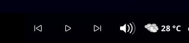

# XFCE MPRIS Controls Panel Plugin

Small XFCE panel plugin with three panel buttons:

- previous track
- play/pause
- next track

It controls media players directly through MPRIS on the session D-Bus, so it works with players such as Firefox, Spotify, VLC, Chromium, Rhythmbox, and others that expose MPRIS controls.



## Dependencies

On Debian/Ubuntu/Xubuntu:

```sh
sudo apt install build-essential pkg-config libxfce4panel-2.0-dev libxfce4ui-2-dev libgtk-3-dev
```

On Fedora:

```sh
sudo dnf install gcc make pkgconf-pkg-config xfce4-panel-devel gtk3-devel
```

## Build

```sh
make
```

## Install

From source:

```sh
make
sudo make install
xfce4-panel -r
```

Then add it to the panel:

1. Right click the XFCE panel.
2. Open **Panel** -> **Add New Items...**.
3. Add **MPRIS Controls**.

## Install Prebuilt Binary

If you downloaded the precompiled binary from a GitHub release on an Ubuntu/Xubuntu-style system:

```sh
tar -xf libmpris-controls.tar.gz
sudo install -m 755 libmpris-controls.so /usr/lib/x86_64-linux-gnu/xfce4/panel/plugins/libmpris-controls.so
sudo install -m 644 mpris-controls.desktop /usr/share/xfce4/panel/plugins/mpris-controls.desktop
xfce4-panel -r
```

Then add MPRIS Controls from the XFCE panel “Add New Items” menu.

Prebuilt binaries are distro and architecture specific. If the plugin does not load, build from source instead.

## Uninstall

```sh
sudo make uninstall
xfce4-panel -r
```

## Notes

The plugin discovers `org.mpris.MediaPlayer2.*` names on the session D-Bus, reads `PlaybackStatus`, and sends MPRIS player methods directly.

## License

MIT
